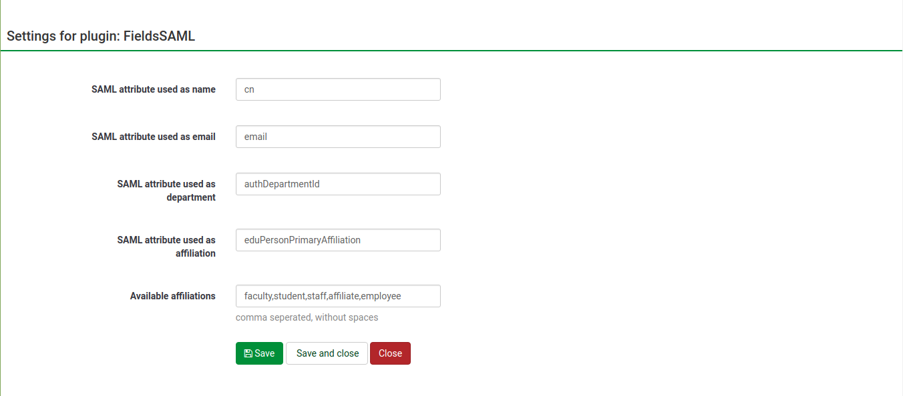
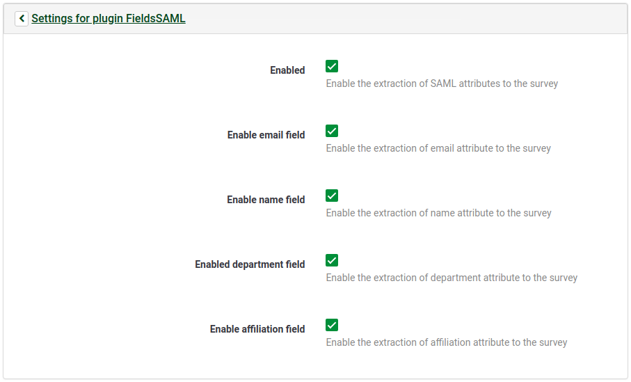
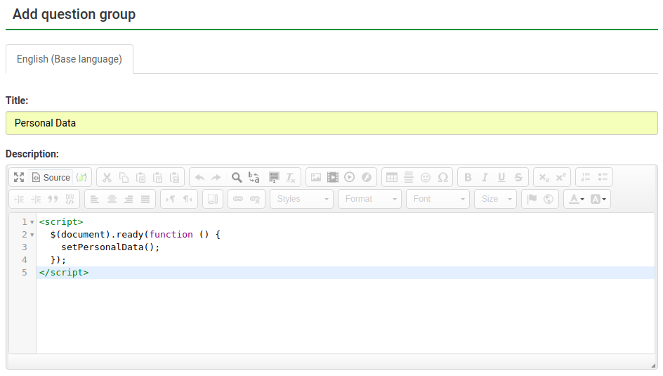
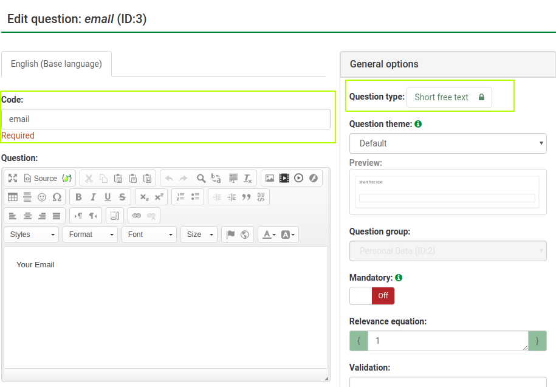
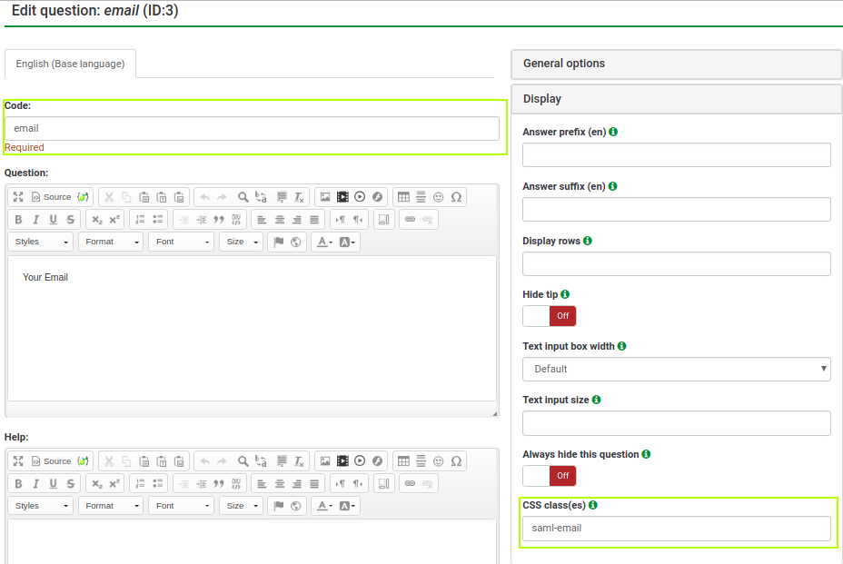
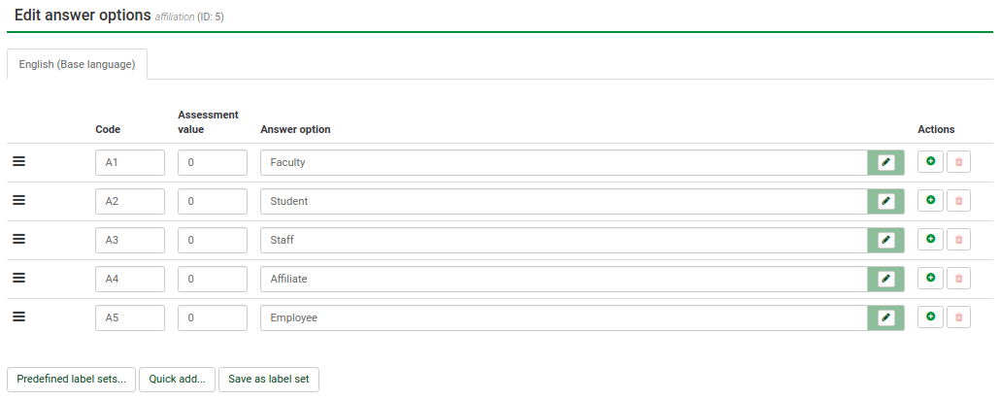
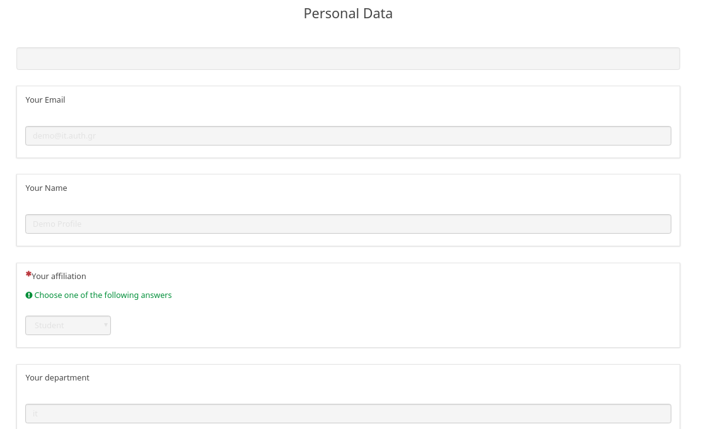

# limesurvey-saml-attributes
Limesurvey plugin to append SAML attributes on survey and the final survey response.

## Requirements
* LimeSurvey 3.XX
* [SAML-Plugin](https://github.com/auth-it-center/Limesurvey-SAML-Authentication)

## Installation instructions
1. Copy **FieldsSAML** folder with its content at **limesurvey/plugins** folder
2. Go to **Admin > Configuration > Plugin Manager** or **https:/example.com/index.php/admin/pluginmanager/sa/index**
and **Enable** the plugin

## Global Configuration
* **SAML attribute used as name** maps to SAML attribute that will be used as a name
* **SAML attribute used as email** maps to SAML attribute that will be used as a email
* **SAML attribute used as department** maps to SAML attribute that will be used as a department
* **SAML attribute used as title** maps to SAML attribute that will be used as a title
* **SAML attribute used as affiliation** maps to SAML attribute that will be used as a affiliation
* **Available affiliations** Comma seperated list. **It is important for latter** when configuring the surveys.
Values map from A1,A2,...,An.
*Example*: faculty,student,staff,affiliate,employee
*Maps to*: A1,A2,A3,A4,A5



## How to enable plugin for specific survey
1. Go to **Surveys > (Select desired survey) > Simple Plugins** or
**https:/example.com/index.php/admin/survey/sa/rendersidemenulink/surveyid/{survey_id}/subaction/plugins**
2. Open **Settings for plugin FieldsSAML** accordion
3. Click **Enabled** checkbox
4. **Enable** desired fields

5. **Create** survey group and name it **Personal Data**
6. **Edit** group description on **Source** mode and add the following snippet
```html
<script>
  $(document).ready(function () {
    setPersonalData();
  });
</script>
```

7. **Create** desired fields and assign them the specified code, type and css-class

| Code          | Type            | CSS-Class        |
|---------------|-----------------|------------------|
| email         | Short Free Text | saml-email       |
| name          | Short Free Text | saml-name        |
| affiliation\* | List Drop Down  | saml-affiliation |
| department    | Short Free Text | saml-department  |
| title         | Short Free Text | saml-title       |

code and type are highlighted


code and css-class are highlighted


(\*) Affiliation field **answer options** are defined like this


## Images

